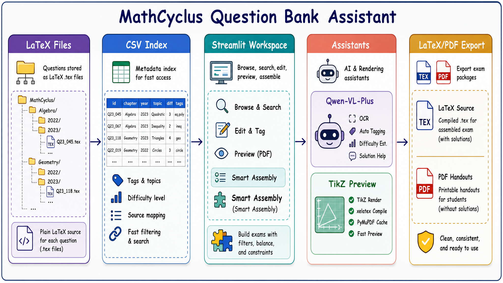

# 📚 高中数学题库管理与组卷系统

这是一个基于 Python (Streamlit) 和 LaTeX 的自动化高中数学题库管理与智能组卷系统。专为中学数学教师及教研团队设计，旨在彻底解决海量 LaTeX 题目的碎片化管理、高效排版以及智能化组卷问题。

## 🧭 系统工作流



系统以本地 SQLite 结构化题库为主存储，同时兼容旧版按章节/年份组织的 LaTeX 题目源文件和 CSV 缓存索引。在 Streamlit 工作台中完成检索、编辑、预览与智能组卷，并通过 Qwen-VL-Plus 和 TikZ 渲染管线增强 OCR、打标签、解答生成和几何图预览能力，最终导出 LaTeX 试卷源文件与 PDF 讲义。

## ✨ 核心功能

### 📝 题库管理

面向 LaTeX 题目源文件的结构化管理流程。

- 按「板块 / 年份」自动归档题目文件。
- 使用 `problem`、`answer`、`solutions` 环境分离题干、答案与解析。
- 通过题目元数据记录 ID、标签、难度、来源与备注。
- SQLite 结构化题库已支持题目本体、来源关系、专题关系、图片资源、修订记录与 TeX 导出。

### 🤖 AI 辅助录入

基于 Qwen-VL-Plus 处理截图、标签和解答生成。

- 识别题目截图并转换为规范 LaTeX。
- 自动生成知识点标签与难度星级。
- 对解答进行“教学审核”，发现逻辑问题时附加 AI 纠错说明。

### 🧠 智能组卷

从题库中按条件筛选、抽样并生成试卷。

- 支持题型、年份、板块、标签、难度与全文检索。
- 支持可选的混合搜索与语义搜索；本地 SQLite 向量索引可随时重建。
- 支持按知识板块、题量与目标难度分布进行抽样。
- 支持自然语言组卷需求润色，辅助形成命题意图。
- 新增 `专题收录` 工作台：可建立大专题/小专题、按编号/三级搜索/试卷/教材收录题目、维护专题引言并导出专题 TeX。
- 数据统计面板已改为 SQLite-first；CSV 和旧 TeX 扫描只作为旧安装环境的兼容兜底。

### 🎨 工作台界面

采用 Streamlit 构建教师可直接使用的本地工作台。

- 三栏式布局：左侧筛选，中间编辑，右侧预览与 AI 助手。
- 徽章式展示星级、标签、备注等题目状态。
- 支持快速浏览、编辑、预览和组卷流程切换。

### 📐 TikZ 预览

将几何图代码直接嵌入题目编辑与预览链路。

- 通过 `xelatex` 编译 TikZ 图形。
- 使用 `PyMuPDF` 将编译结果转为 PNG 预览。
- 基于文件修改时间缓存，减少重复渲染开销。

## 🛠️ 技术栈

- **前端界面与交互**：[Streamlit](https://streamlit.io/) (响应式框架，多列布局，回调机制)
- **排版与编译引擎**：**$\LaTeX$** (核心依赖 `xelatex` 编译器)
- **底层脚本与处理**：Python (`re` 文本处理, `fitz` PDF图像解析, 抽样算法)
- **结构化存储**：SQLite (`data/mathcyclus.sqlite3` 本地私有库，schema 与迁移脚本随源码发布)
- **大语言模型支持**：阿里云百炼 (Qwen-VL-Plus 模型)
- **版本控制**：Git/GitHub (配置代理优化大文件传输同步)

## 🚀 快速启动

1. Windows 一键启动支持 **64 位 CPython 3.10 - 3.12**，推荐 Python 3.12。安装 Python 时建议勾选 **Python Launcher** 和 **Add python.exe to PATH**；若本机只有 Python 3.13 或更高版本，可并行安装 Python 3.12，无需卸载新版。

   `启动程序.bat` 会优先通过 Python Launcher 选择 3.12、3.11 或 3.10；Launcher 不可用时会尝试 `PATH` 中的 `python`。首次运行会自动创建 `.venv`、安装依赖，并补齐本地运行目录和空 SQLite 库。

2. 如需手动创建虚拟环境并安装依赖，可执行：

   ```bash
   python -m venv .venv
   .venv\Scripts\activate
   pip install -r requirements.txt
   ```
3. 初始化本地运行目录和空 SQLite 数据库：

   ```bash
   python scripts/init_local_workspace.py
   ```

   该脚本只创建本机运行目录和空库，不覆盖已有 `data/mathcyclus.sqlite3`。
4. 复制 `.env.example` 为 `.env`，并填入 AI 模型配置：

   ```env
   AI_API_KEY=your_api_key_here
   AI_BASE_URL=https://dashscope.aliyuncs.com/compatible-mode/v1
   AI_MODEL_NAME=qwen-vl-plus
   # 可选：启用混合/语义搜索
   AI_EMBEDDING_MODEL_NAME=text-embedding-v4
   ```
   配置 embedding 模型后，在“工具箱 → 语义搜索索引”中更新索引；留空时系统继续使用原有精确筛选。
5. 如需使用 TikZ 几何图预览，请安装完整的 **$\LaTeX$ 编译环境**（例如 TeX Live），并确认 `xelatex` 已加入系统环境变量。项目会通过 `PyMuPDF` 将编译结果转为 PNG 预览。
6. 旧版 TeX 题库用户如果仍依赖 `chapters/` 和 `utils/题库索引表.csv`，可以手动重建兼容索引：

   ```bash
   python utils/init_csv_index.py
   ```
7. 如果要把旧版 `chapters/` 迁移到 SQLite，可进入网页中的 `工具箱 → 旧 TeX 迁移到 SQLite`，先生成预览库和提升检查报告，再用强确认按钮正式提升到 `data/mathcyclus.sqlite3`。
8. 双击运行 `启动程序.bat`，或者在终端执行：

   ```bash
   python 启动程序.py
   ```

   即可自动在浏览器中打开工作台。

也可以直接运行 Streamlit：

```bash
streamlit run question_bank_app.py
```

## 🔄 本地升级

如果你是从 GitHub clone 的源码版，建议先预览更新计划：

```bash
python scripts/update_local_installation.py --pull --install-deps --run-checks
```

确认没有阻塞后再实际执行：

```bash
python scripts/update_local_installation.py --apply --pull --install-deps --run-checks
```

如果只想检查或应用 SQLite schema 迁移：

```bash
python scripts/migrate_schema.py --status-only
python scripts/migrate_schema.py
python scripts/migrate_schema.py --apply
```

更新脚本默认保护本地数据：执行前会备份 SQLite、图片资源和配置文件，不删除旧 `.tex`，不上传 `.env`、数据库、图片、报告或导出文件。
发布前总检查会运行更新助手 smoke，确认 dry-run 更新计划不会拉取代码、安装依赖、写报告或覆盖本地数据。

也可以在网页内操作：

- `工具箱 → 本地维护与升级`：检查数据库版本、设置本地默认数据源、预览/执行本地升级、导出/检查/恢复本地数据迁移包；
- `工具箱 → 旧 TeX 迁移到 SQLite`：为早期 TeX 题库用户生成 SQLite 预览库、提升检查报告，并提供强确认正式提升入口；旧 `.tex` 文件不会被删除。
- `专题收录`：基于 SQLite 专题表管理专题目录、分组题目、题目顺序和专题 TeX 导出。

## 📦 发布与打包边界

源码版或未来安装包的“程序部分”不能直接压缩整个项目目录，必须使用白名单脚本：

```bash
python scripts/build_source_release_package.py --json
python scripts/build_source_release_package.py --create
```

白名单包只包含源码、schema、迁移脚本、模板、文档和必要 UI 资源；不会包含 `.env`、本地 SQLite、`db/seed/*.csv`、题目图片、报告、导出文件或旧 `chapters/` 题源。

如果历史版本中已有旧题源或导出文件被 Git 跟踪，先审计再取消跟踪：

```bash
python scripts/audit_tracked_private_files.py
python scripts/audit_tracked_private_files.py --apply --confirm KEEP_LOCAL
```

`git rm --cached` 只移除 Git 跟踪，不删除本地文件。

## 💡 创新亮点

- **首创"教学审核"OCR**：AI 识别解答时自动审核逻辑，发现错误会标注原错并附加 AI 纠错，兼顾教学真实性与正确性。
- **严苛的 LaTeX 排版规范**：通过 AI Prompt 强制约束分数显示、括号匹配、中英文混排空格等细节，输出代码可直接用于专业出版。
- **Label Data 元数据系统**：每道题自带 ID、难度星级、标签、备注、引用次数的结构化注释头，实现题目级别的精细化管理。
- **TikZ 深度整合 + 智能缓存**：几何图形编译无缝嵌入编辑流程，基于文件修改时间的缓存机制实现秒级实时预览。

## 📁 核心目录结构

```text
├── chapters/              # 存放按学科板块和年份分类的 LaTeX 题库源文件 (.tex)
├── db/                    # SQLite schema、迁移脚本和 seed 占位目录
├── services/              # 数据库、编辑、导出、统计、图片和迁移等服务层
├── scripts/               # 本地初始化、迁移、审计、smoke 和发布检查脚本
├── data/                  # 本地 SQLite 数据库、本地偏好和备份（默认不提交）
├── assets/questions/      # 题目图片资源（默认不提交）
├── reports/               # 本地审计和迁移报告（默认不提交）
├── exports/               # 本地导出文件（默认不提交）
├── fig/                   # README 与文档配图
├── utils/                 # 系统核心工具库 (配置、文件读写、TikZ 渲染、CSV 索引管理)
├── Test Paper Group/      # LaTeX 试卷/讲义/练习模板；导出成品默认不提交
├── ocr_prompt.txt         # AI OCR 与排版约束的系统提示词（热重载）
├── MathCyclus_book.cls    # LaTeX 自定义文档类
├── question_bank_app.py   # Streamlit 主程序入口 (包含 UI 布局与核心逻辑)
├── 启动程序.py             # 守护进程与服务启动脚本
├── 启动程序.bat            # Windows 一键启动脚本
├── requirements.txt       # Python 依赖清单
└── .env.example           # 环境变量配置模板
```

## 🧹 仓库维护说明

- `utils/题库索引表.csv` 是每台电脑独立生成的高速索引，不提交到 Git；题库内容变化后可运行 `python utils/init_csv_index.py` 刷新。
- `data/mathcyclus.sqlite3` 是每台电脑自己的正式 SQLite 题库，不提交到 Git；新用户通过 `python scripts/init_local_workspace.py` 创建空库。
- `data/local_preferences.json` 保存本机默认数据源偏好，不提交到 Git；本地数据迁移包会默认包含它。
- `assets/questions/` 存放每道题关联的非 TikZ 图片资源，不提交到 Git；迁移时通过本地数据包一起转移。
- `reports/` 和 `exports/` 是本地审计报告与导出结果，不提交到 Git。
- `db/schema.sql` 与 `db/migrations/` 是公开源码的一部分，用于新安装和版本升级。
- `db/seed/*.csv` 与 `db/seed/*.json` 通常来自个人题库迁移和人工复核，不提交到 Git；源码中只保留 `db/seed/.gitkeep`。
- `db/migrations/0002_topic_intro_fields.sql` 为专题表增加题目引言、答案引言和导出备注字段；旧库需通过 schema 迁移升级后使用专题收录。
- `scripts/migrate_schema.py` 默认只 dry-run；正式应用 schema 迁移必须显式加 `--apply`。
- `utils/local_stats.sqlite3` 保存本机新增、修改和活跃度统计，不提交到 Git。首次建立索引只记录本地基线，不会把仓库历史题目算作当前用户的新增。
- `utils/semantic_index.sqlite3` 是可选且可重建的语义索引，不应提交到 Git；题目保存、删除或重命名后，对应旧向量会自动失效。
- 批量识别或同卷录入遇到已存在的同名题目时，默认保留旧文件并跳过新的识别结果；处理日志会明确标记为“跳过”。
- `chapters/`、`Test Paper Group/导出文件/`、`old_app.py`、`question_bank_app000.py` 和 `SolaireEPDA-master/` 属于本地题源、导出成品、历史产物或外部参考内容。当前 `.gitignore` 已将同类文件排除；如历史上已被 Git 跟踪，使用 `scripts/audit_tracked_private_files.py --apply --confirm KEEP_LOCAL` 取消跟踪。
- TikZ 预览依赖本机 `xelatex`，若未安装 LaTeX，题库浏览与普通组卷仍可使用，但几何图实时预览会受限。

## 📄 开源协议

本项目采用 MIT License 开源协议，欢迎贡献与使用。

## 👥 用户群

如果你正在使用或关注 MathCyclus，欢迎扫码加入用户群，交流本地部署、题目录入、LaTeX 排版、组卷流程与后续功能建议。


